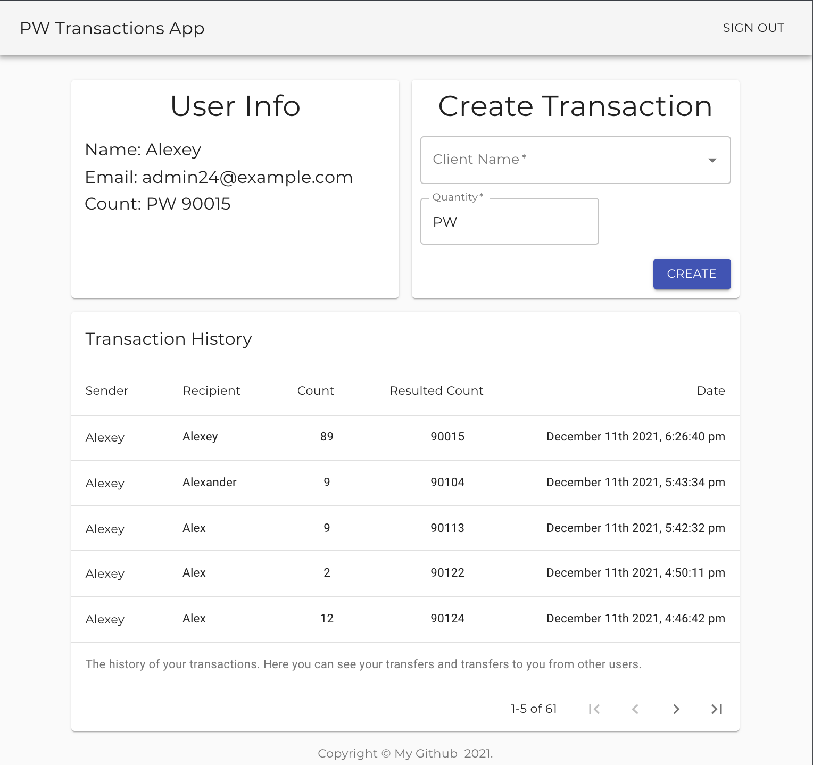

## Тех. задание

Разработать приложение для транзакций монеты.

### Основные положения:

- Страница авторизации пользователя.
- Страница Home с блоками:
    - Поле Имя получателя.
    - Поле Количество.
    - История транзакций.
    - Блок с основной информацией авторизованного пользователя.
  

  
  
## 1. Установка зависимостей

### `npm install`

## 2. Запуск приложения

### `npm start`

Запускает приложение в режиме разработки. 
Откройте [http://localhost:3000](http://localhost:3000) для просмотра в браузере .

## Дополнительно

Для форматирования кода

### `npm run fix`

Дополнительные команды можно посмотреть тут
[Create React App Available Scripts](https://create-react-app.dev/docs/available-scripts/).
